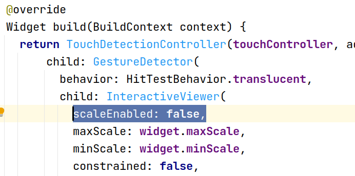
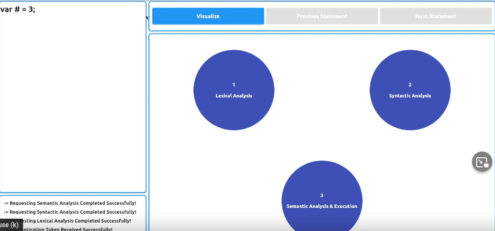
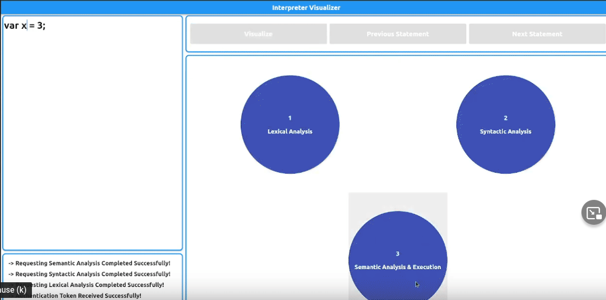
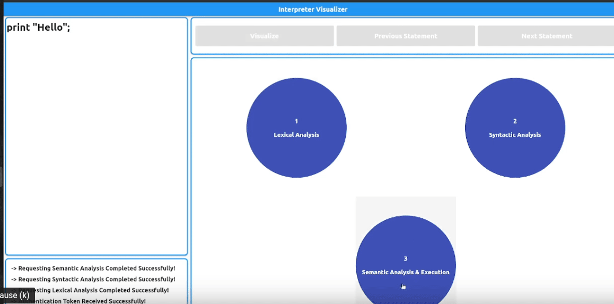

# Interpreter Visualizer 
Believing in visualization as a very interactive method to help enhance and improve education, We have developed this very new desktop application to help and inspire Compiler Design learners so that they get a better experience and understand it well. We also want to inspire other programmers around the world to help create more educational applications or improve the already existing ones.

## Table of content:
1. [Idea of the project](#idea) 
2. [Lox Language](#lox)
3. [How to use](#install)
4. [Examples](#ex)
5. [Depedencies](#Depend)
6. [Contribution](#con)

### Idea of the project

This application simply visualizes the front-end part of interpreters or compilers and that includes Lexical Analysis, Syntactic Analysis and Semantic analysis.
You can use this application as a compiler design teacher or as a student to help visualize the whole process and examine your understanding to the subject. Also, it can help you understand where your error in the code fail the interpreter to work. 

### Lox Language

This programming laguage is the one used in our application to be visualized. It is an educational language created by [Robert Nystrom](https://github.com/munificent) in his famous book [Crafting interpreters](https://craftinginterpreters.com/contents.html) which we have used to help us create its interpreter. The reason we chose this language is that it is very simple, a C-style language and its grammar is very easy to read through. But our project does not only visualize Lox, **it can actually visaulize any programming language**, but you will need to change the back-end side of the project but the front-end will just work the same.
Have a look at the language simple grammar [here](LoxGrammar). **We have not implemented yet all the grammar included in the crafting interpreters book**.

You may also check some examples and learn more about the syntax of the language from [here](https://craftinginterpreters.com/the-lox-language.html). But notice that we have only implemented what you will find in the [grammar file](LoxGrammar), some parts of the language like the OOP or the functions are not implemented yet. So, if you doubt any part of the language to use just check the [grammar file](LoxGrammar).

### How to use

This application consists of two separate parts the desktop/web front-end part which is written in Flutter and the back-end side written in Java Spring. The back-end side is found in the folder [**InterpreterVisualizer**](https://github.com/OsamaMaani/Interpreter-Visualizer/tree/master/InterpreterVisualizer).

Make sure to:

1- Use the same port and IP address for both the back-end side and the fron-end side and you can modify that in the [properties file](https://github.com/OsamaMaani/Interpreter-Visualizer/blob/master/InterpreterVisualizer/src/main/resources/application.properties) in the back-end project and you can modify that in the [networking file](https://github.com/OsamaMaani/Interpreter-Visualizer/blob/master/lib/services/networking.dart) in the Flutter project.

2- Modify the graphite library so that it works properly for  the project. You will head to the external libraries in the flutter project and then you will find graphite library folder, you will then open **graphite_edges.dart** and then go to  **_GraphiteEdgesState** class and then head to **InteractiveViewer** widget and add **scaleEnabled: false**. This attribute will make sure that the zooming in the screen is off and there will not be unexpected functionalities caused by the zooming.

.

### Examples

 
 **Example One**
 
 In this example you can see how the tokenization process goes on token by token with each one gets a unique color according to its type. 

**Example Two**

In this example you can see here how a character can't be recognized if it is not a part of the language like the **#** symbol in our case.
Also, an immediate message in the **console** appears to indicate that error.

**Example Three**

In this example you can see the panel is divided into two smaller panels, the right one to show how the interpreter recursively search the grammar to find the specific grammar of the expression creating **the Parsing Tree** and on the left you can see the **Abstract Syntax Tree**(AST). 
You can also see a camera icon beside the title in each panel and if it is clicked it will immediately generate a screenshot to either the parsing tree or the AST to the moment you clicked. 

**Example Four**

In this example you can see the semantic analysis visualization including the symbol table in the bottom of the screen.

**Example Five**
Here, in this example you can see how the semantic analysis phase can produce output in the **console** using print expression.

### Dependencies

The Dependencies used in the Flutter Desktop/Web app.
1. [HTTP package](https://pub.dev/packages/http)
2. [Provider Package](https://pub.dev/packages/provider) 
3. [path_provider](https://pub.dev/packages/path_provider)
4. [graphite](https://pub.dev/packages/graphite)
5. [Flutter Progress Hud](https://pub.dev/packages/flutter_progress_hud)
6. [screenshot](https://pub.dev/packages/screenshot)

The Dependencies used in the Java Spring back-end app.

1- [JSON](https://mvnrepository.com/artifact/org.json/json/20090211)

## Contribution

Follow the guides mentioned in the [CONTRIBUTING.md](contribution.md).

